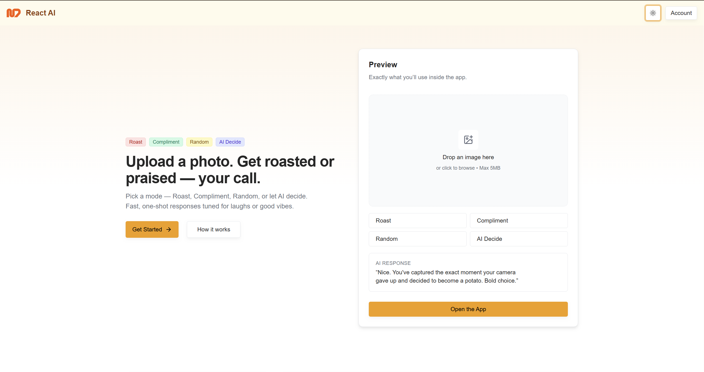
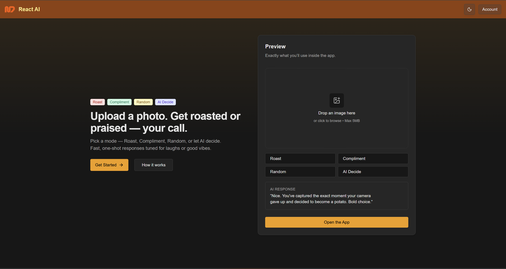
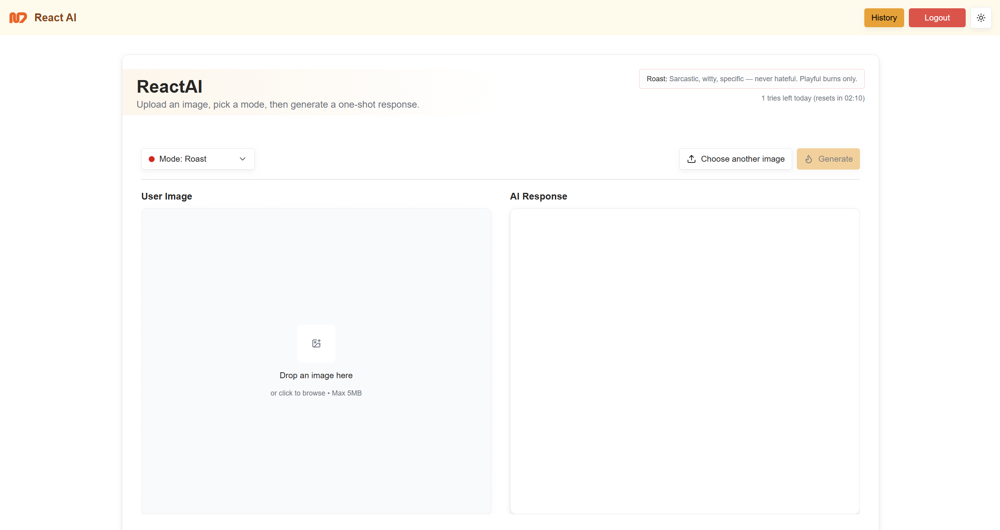
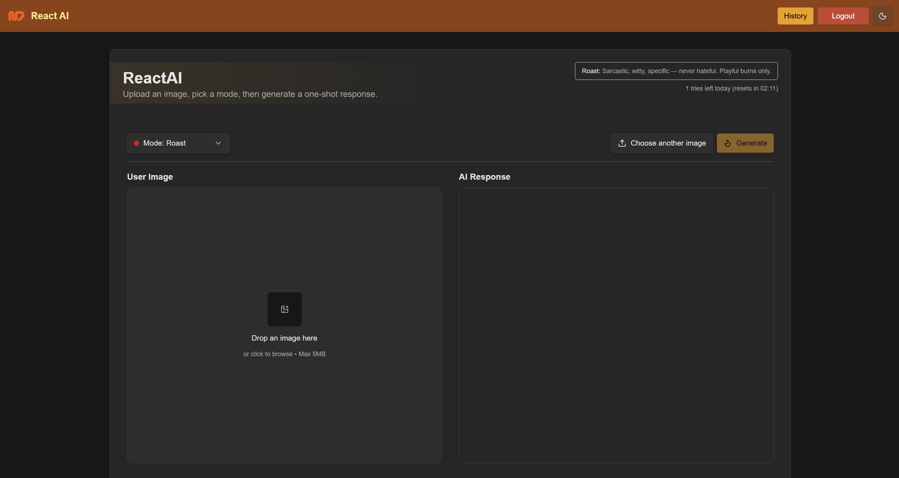
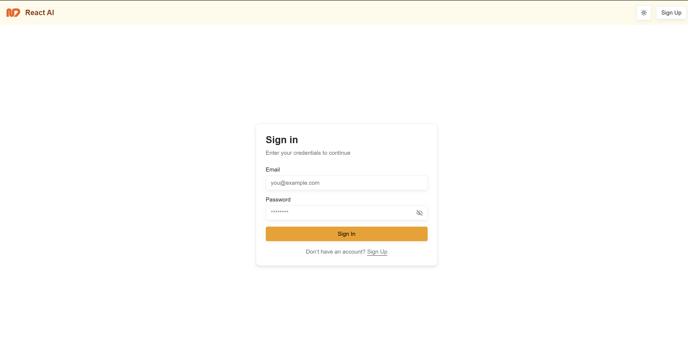
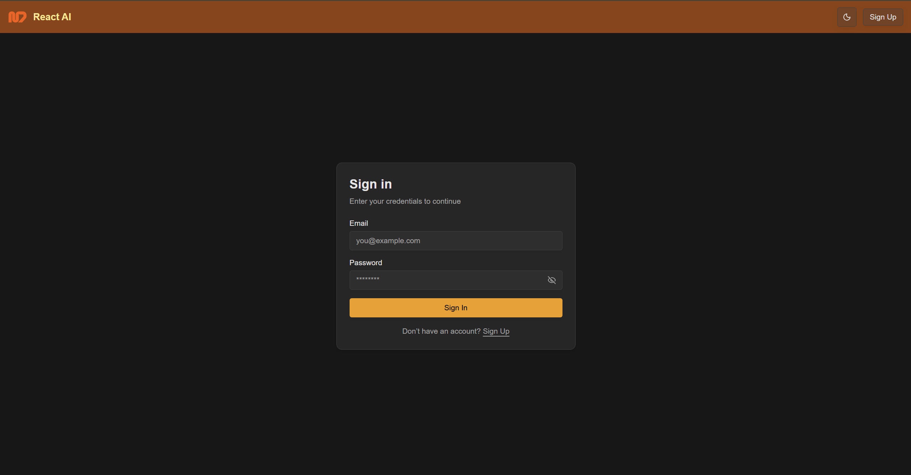

# 🔥 ReactAI – Roast / Compliment Bot

ReactAI is a fun, image‑aware web app that lets you upload a picture and instantly get a **witty roast** or a **genuine compliment**.
Choose your vibe — Roast, Compliment, Random, or let **AI Decide** — and share the results with your friends.

---

## 📸 Preview

> Light & Dark modes side‑by‑side (images in `/public`).

 Light Mode                                       | Dark Mode                                      |
 ------------------------------------------------ | ---------------------------------------------- |
         |          |
 |  |
       |        |


---

## ✨ Features

* 🖼️ **Image Uploads** – drag & drop or select a photo
* 🔥 **Roast Mode** – sarcastic burns and cheeky jokes, always light‑hearted
* 💖 **Compliment Mode** – warm, genuine compliments that feel natural
* 🎲 **Random Mode** – flips a coin between roast/compliment
* 🤖 **AI Decide** – model picks the best response based on the image/context
* ⏳ **Daily Limits** – 5 free responses per device per 24h (configurable)
* 📜 **History** – signed‑in users can view past roasts/compliments
* 👤 **Authentication** – sign up/in with Appwrite
* 🌙 **Dark Mode** – theme toggle included

---

## 🛠️ Tech Stack

* **Frontend**: Next.js 15, React Hook Form, Zod
* **Styling**: Tailwind CSS, shadcn/ui
* **Backend / Infra**: Appwrite (Auth, DB, Functions, Storage, Sites)
* **AI**: Appwrite Function that calls OpenAI
* **Other**: SSR auth with cookies, Appwrite Storage uploads, simple rate‑limit via client cookies

---

## 🚀 Getting Started

### 1) Clone the repository

```bash
git clone https://github.com/yourname/reactai.git
cd reactai
```

### 2) Install dependencies

```bash
bun install
# or
npm install
```

### 3) Configure environment variables

Create a `.env.local` in the project root with **exactly** these keys:

```env
NEXT_PUBLIC_APPWRITE_ENDPOINT=https://cloud.appwrite.io/v1
NEXT_PUBLIC_APPWRITE_PROJECT=
NEXT_PUBLIC_APPWRITE_FUNCTION_ID=
NEXT_PUBLIC_APPWRITE_BUCKET_ID=
NEXT_PUBLIC_APPWRITE_DATABASE_ID=
NEXT_PUBLIC_APPWRITE_COLLECTION_ID=
NEXT_PUBLIC_LIMIT=5 # default to 5 if not set

# Security - keep these secret
ROAST_CLIENT_API_KEY= # your roast api key here put any string but it has to match the one in the function
APPWRITE_API_KEY=
```

> Notes
>
> * `NEXT_PUBLIC_*` values are exposed to the client; keep **only** what’s safe there.
> * `APPWRITE_API_KEY` must be a server key with scopes for the resources you use.
> * `ROAST_CLIENT_API_KEY` must match what your function checks via the `x-api-key` header.

---

## 🧰 Appwrite Setup (CLI)

> Endpoint differs by region (e.g., `https://fra.cloud.appwrite.io/v1`, `https://cloud.appwrite.io/v1`, etc.). Use the endpoint shown in your Appwrite Console for your project.

### A) Install & init

```bash
# Install CLI
npm i -g appwrite-cli
# Login
appwrite login
# Initialize a project (creates appwrite.json)
appwrite init project
```

Follow the prompts and select your project (or create one). When asked, set the **endpoint** to your region’s value.

### B) Create empty resources

Create **one empty** of each in the Console (simplest) or via CLI:

* **Function** → name: `chatgpt`, runtime: `node-22`
* **Bucket** → name: `Images`
* **Database** → name: `Data`
* **Collection** (inside that DB) → name: `Image prompts` (no attributes yet)

Copy the **IDs** of each. Display names can be changed later; **IDs must match** what you put in the JSON.

### C) Paste IDs into the template and push

Replace placeholders in the JSON below with your real IDs. Save as `appwrite.json` (or merge into the one created by `init`) and push everything:

```bash
appwrite push --all
```

**Template:**

```json
{
  "projectId": "###REPLACE_PROJECT_ID###",
  "endpoint": "https://fra.cloud.appwrite.io/v1",
  "projectName": "Hackathon ",
  "settings": {
    "services": {
      "account": true,
      "avatars": true,
      "databases": true,
      "locale": true,
      "health": true,
      "storage": true,
      "teams": true,
      "users": true,
      "sites": true,
      "functions": true,
      "graphql": true,
      "messaging": true
    },
    "auth": {
      "methods": {
        "jwt": true,
        "phone": true,
        "invites": true,
        "anonymous": true,
        "email-otp": true,
        "magic-url": true,
        "email-password": true
      },
      "security": {
        "duration": 31536000,
        "limit": 0,
        "sessionsLimit": 10,
        "passwordHistory": 0,
        "passwordDictionary": false,
        "personalDataCheck": false,
        "sessionAlerts": false,
        "mockNumbers": []
      }
    }
  },
  "functions": [
    {
      "$id": "###REPLACE_FUNCTION_ID###",
      "name": "chatgpt",
      "runtime": "node-22",
      "specification": "s-0.5vcpu-512mb",
      "execute": ["any"],
      "events": [],
      "scopes": ["users.read"],
      "schedule": "",
      "timeout": 15,
      "enabled": true,
      "logging": true,
      "entrypoint": "src/main.js",
      "commands": "npm install",
      "path": "functions/chatgpt"
    }
  ],
  "databases": [
    {
      "$id": "###REPLACE_DATABASE_ID###",
      "name": "Data",
      "enabled": true
    }
  ],
  "collections": [
    {
      "$id": "###REPLACE_COLLECTION_ID###",
      "$permissions": [
        "create(\"any\")",
        "read(\"any\")",
        "update(\"any\")",
        "delete(\"any\")"
      ],
      "databaseId": "###REPLACE_DATABASE_ID###",
      "name": "Image prompts",
      "enabled": true,
      "documentSecurity": true,
      "attributes": [
        {
          "key": "reply",
          "type": "string",
          "required": true,
          "array": false,
          "size": 999999,
          "default": null,
          "encrypt": false
        },
        {
          "key": "userId",
          "type": "string",
          "required": true,
          "array": false,
          "size": 255,
          "default": null,
          "encrypt": false
        },
        {
          "key": "fileId",
          "type": "string",
          "required": true,
          "array": false,
          "size": 255,
          "default": null,
          "encrypt": false
        },
        {
          "key": "mode",
          "type": "string",
          "required": true,
          "array": false,
          "elements": ["roast", "compliment", "ai_decide", "random"],
          "format": "enum",
          "default": null
        }
      ],
      "indexes": [
        {
          "key": "by_user_id",
          "type": "key",
          "status": "available",
          "attributes": ["userId"],
          "orders": ["ASC"]
        },
        {
          "key": "by_id_and_user_id",
          "type": "key",
          "status": "available",
          "attributes": ["$id", "userId"],
          "orders": ["ASC", "ASC"]
        }
      ]
    }
  ],
  "buckets": [
    {
      "$id": "###REPLACE_BUCKET_ID###",
      "$permissions": [
        "create(\"any\")",
        "read(\"any\")",
        "update(\"any\")",
        "delete(\"any\")"
      ],
      "fileSecurity": false,
      "name": "Images",
      "enabled": true,
      "maximumFileSize": 5000000000,
      "allowedFileExtensions": [],
      "compression": "none",
      "encryption": true,
      "antivirus": true
    }
  ]
}
```

> Tips
>
> * Ensure your local directory matches the function `path` (e.g., `functions/chatgpt/src/main.js`).
> * If you changed display names in Console, that’s fine; IDs must still match this file.

---
## Varibles to add to the function from appwrite console
```bash
CLIENT_API_KEY=
APPWRITE_PROJECT=
APPWRITE_ENDPOINT=
OPENAI_MODEL=
OPENAI_API_KEY=
```
rebuild the function using
```bash
appwrite push functions --all
```
---

## ▶️ Run locally

```bash
bun dev
# or
npm run dev
```

App runs at [http://localhost:3000](http://localhost:3000)

---

## ⚖️ License

MIT — have fun.

---

## 🙌 Acknowledgements

* Appwrite for the backend
* shadcn/ui for UI components
* OpenAI for the brain behind the roasts & compliments
